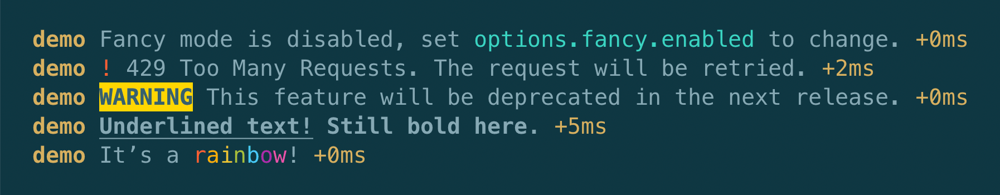

# debug-color-formatter

A `%c` formatter for [debug][] to unify rich text formatting on the server with
[how it’s done in the browser console][browser]. Result: the same formatting and
**no additional code is sent to the browser!**



## Usage

### Install

Add to your project with your choice of package manager:

```console
$ yarn add debug-color-formatter
$ npm install debug-color-formatter
```

### Setup

All you need to do is add this function to [debug’s `formatters`
object][formatters]:

```js
import createDebug from 'debug';
import colorFormatter from 'debug-color-formatter';

createDebug.formatters.c = colorFormatter;
```

### Formatting

Use `%c` and CSS style rules to format text in your debug messages:

```js
const debug = createDebug('demo');

debug(
  'Fancy mode is disabled, set %coptions.fancy.enabled%c to change.',
  'color: cyan',
  ''
);
debug(
  '%c!%c 429 Too Many Requests. The request will be retried.',
  'color: red',
  ''
);
debug(
  '%cWARNING%c This feature will be deprecated in the next release.',
  'font-weight: bold; background-color: #ffcf00; color: black',
  ''
);
```

Almost any formatting that can be accomplished in a standard terminal with ANSI
escape codes will be translated. Others that may work in the browser console
(e.g. `text-shadow`) will be ignored.

To reset all formatting, render `%c` with an empty string value. It is good
practice to reset all formatting at the end of your message. To reset specific
properties, use their standard initial CSS value or `inherit`, e.g.

```js
debug(
  '%cUnderlined text!%c Still bold here.%c',
  'font-weight: bold; text-decoration: underline',
  'text-decoration: none',
  ''
);
```

## Motivation

When you want your debug logging code to be “universal” or “isomorphic” (the
same code runs on the server and web browser), the fantastic [debug][] library
already has you covered there.

But what if you want some simple text formatting in your debug messages, like
colors and bold text? This can further aid in debugging by rendering certain
errors in red, warnings in yellow, emphasizing variable names or config options,
etc.

Both the server and (most) browser consoles have the ability to render such
formatted text. **But they do this very differently: on the server, you must use
[ANSI escape codes][ansi], while browsers use a [`%c` substitution
directive][browser] with styles specified via CSS strings.**

You have two options for reconciling this difference: either you ship extra code
to the browser to translate ANSI codes to the `%c` style substitution, or you do
the reverse for the server. Unfortunately, the former option adds to your bundle
size. If we instead make `%c` formatting work on the server, then we don’t have
to send any new code to the browser at all! And thankfully, [debug][] allows you
to add new formatting directives.

## Bundling

Your bundler should understand the `browser` field in `package.json` in order to
point to the correct code for the browser.
[webpack does this](https://webpack.js.org/configuration/resolve/#resolvemainfields)
by default.

Note that the correct code for the browser is a
[completely empty file](./src/browser.js) – the point of this library is to
bring a browser feature to the server, not the other way around! 🙂

[debug]: https://github.com/visionmedia/debug
[formatters]: https://github.com/visionmedia/debug#custom-formatters
[browser]:
  https://developer.mozilla.org/en-US/docs/Web/API/console#Styling_console_output
[ansi]: https://en.wikipedia.org/wiki/ANSI_escape_code
